# Te Reo Bot - SQLite Dictionary Architecture Plan

## Executive Summary

This document outlines the architectural design for adding SQLite database support to the Te Reo Bot application. The solution addresses the current limitations of using a flat JSON file by introducing a persistent SQLite database to store all Māori words, enabling better word management, historical tracking, and maintainability.

**Key Objectives:**
- Replace ephemeral dictionary.json approach with persistent SQLite storage
- Maintain all historical words (not just 365-366)
- Introduce a CLI command to generate dictionary.json from SQLite
- Validate data integrity (366 unique day indexes)
- Preserve backward compatibility with existing posting mechanism
- Simplify word management and reduce human errors

---

## System Context

### Current System

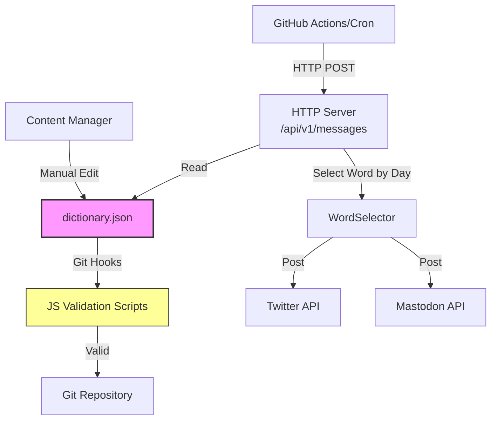

### Proposed System

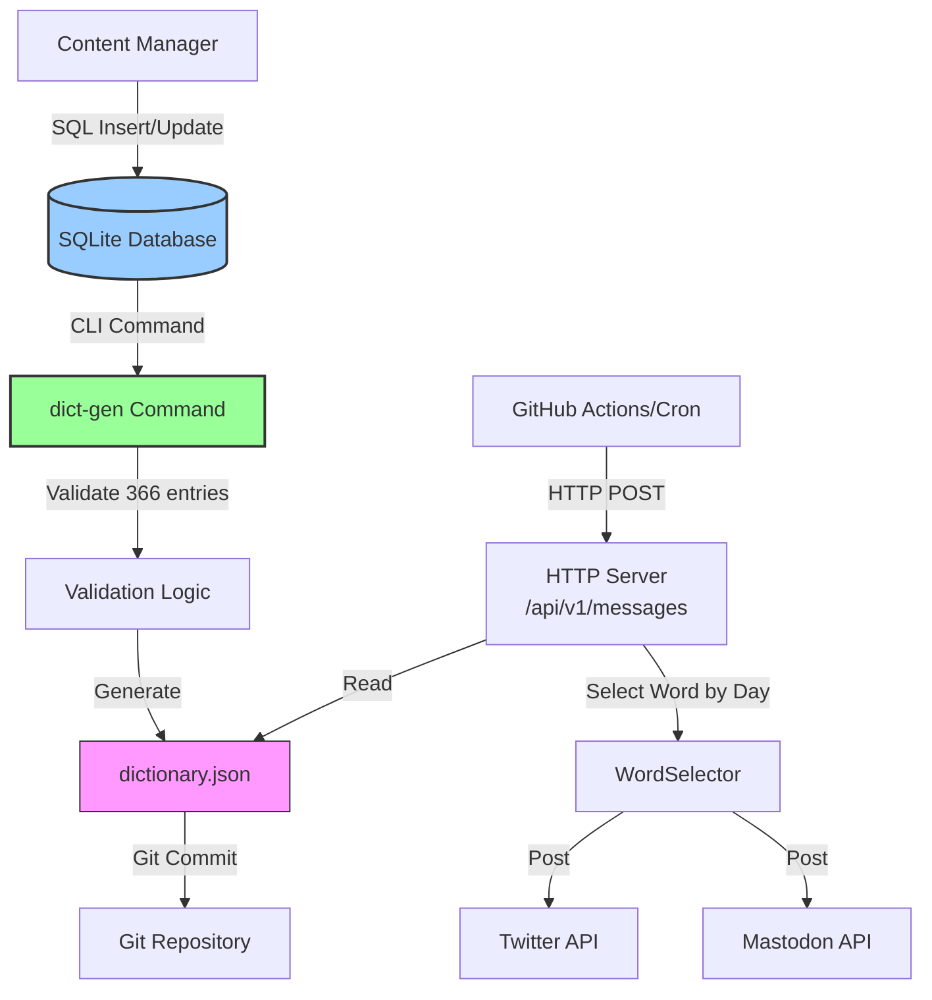

**Explanation:**

The new architecture introduces SQLite as the source of truth for all words, while maintaining the existing JSON-based posting mechanism for backward compatibility and simplicity. The dictionary.json file becomes a generated artifact rather than a manually-edited source file.

**External Actors:**
- **Content Managers**: Add/edit words in SQLite database
- **GitHub Actions**: Scheduled triggers for daily posts
- **Social Media Platforms**: Twitter and Mastodon APIs
- **Git Repository**: Version control for generated dictionary.json

---

## Architecture Overview

### Architectural Approach

This solution follows a **Separation of Concerns** pattern with these key principles:

1. **Data Layer**: SQLite database as the persistent data store
2. **Generation Layer**: CLI command to generate dictionary.json
3. **Application Layer**: Existing HTTP server (unchanged)
4. **Integration Layer**: Existing social media clients (unchanged)

**Patterns Used:**
- **Repository Pattern**: Abstract data access through a repository interface
- **Command Pattern**: CLI commands for specific operations (generate, validate, migrate)
- **Generator Pattern**: Transform database records to JSON format
- **Validator Pattern**: Ensure data integrity before generation

---

## Component Architecture

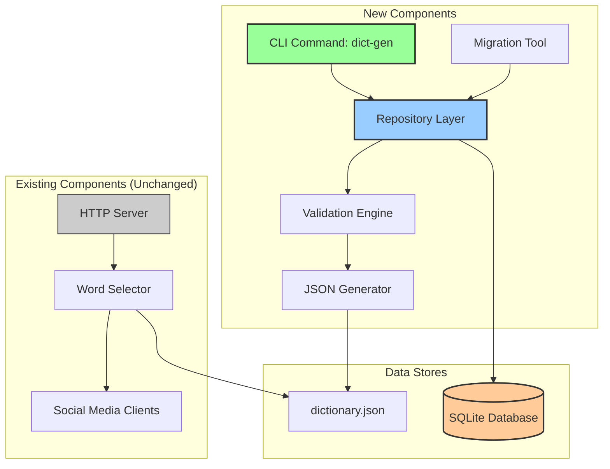

### Component Descriptions

#### 1. CLI Command (`cmd/dict-gen`)
**Responsibility**: Entry point for dictionary management operations

**Sub-commands:**
- `generate`: Generate dictionary.json from SQLite
- `validate`: Validate database integrity (366 entries, unique indexes)
- `migrate`: Import existing dictionary.json into SQLite (one-time)
- `add-word`: Add a new word to database (optional utility)
- `list-words`: List all words with their indexes

**Key Functions:**
- Parse command-line arguments
- Invoke repository and business logic
- Report success/failure with meaningful messages

#### 2. Repository Layer (`pkg/repository`)
**Responsibility**: Abstract data access to SQLite database

**Interfaces:**
```go
type WordRepository interface {
    GetAllWords() ([]Word, error)
    GetWordsByDayIndex() (map[int]Word, error)
    GetWordByIndex(index int) (*Word, error)
    AddWord(word *Word) error
    UpdateWord(word *Word) error
    DeleteWord(id int) error
    GetTotalCount() (int, error)
}
```

**Implementation:**
- Open/close database connections
- Execute SQL queries safely (prepared statements)
- Handle transactions for data consistency
- Map database rows to Go structs

#### 3. Validation Engine (`pkg/validator`)
**Responsibility**: Ensure data integrity before generation

**Validation Rules:**
- Exactly 366 words with day indexes (1-366)
- Each day index appears exactly once
- No gaps in day index sequence
- Required fields are non-empty (word, meaning)
- Optional: validate UTF-8 encoding for Māori characters

**Returns:**
- Validation report with errors/warnings
- Success flag
- List of missing/duplicate indexes

#### 4. JSON Generator (`pkg/generator`)
**Responsibility**: Transform database records to dictionary.json format

**Key Functions:**
- Retrieve words from repository
- Sort words by day index (1-366)
- Format as JSON structure matching current schema
- Write to file with proper formatting
- Preserve UTF-8 encoding for Māori characters

#### 5. Migration Tool (`pkg/migration`)
**Responsibility**: One-time import of existing dictionary.json into SQLite

**Process:**
1. Parse existing dictionary.json
2. Create SQLite schema
3. Insert each word as a record
4. Generate unique IDs
5. Preserve all existing metadata
6. Create backup of original file

---

## Database Schema

### SQLite Schema Design

```sql
-- Words table: stores all Māori words and their metadata
CREATE TABLE words (
    id INTEGER PRIMARY KEY AUTOINCREMENT,
    day_index INTEGER UNIQUE,  -- 1-366, nullable for words not assigned to a day
    word TEXT NOT NULL,
    meaning TEXT NOT NULL,
    link TEXT,
    photo TEXT,
    photo_attribution TEXT,
    created_at DATETIME DEFAULT CURRENT_TIMESTAMP,
    updated_at DATETIME DEFAULT CURRENT_TIMESTAMP,
    is_active BOOLEAN DEFAULT 1,  -- soft delete flag
    
    CHECK (day_index IS NULL OR (day_index >= 1 AND day_index <= 366))
);

-- Index for fast lookups by day
CREATE INDEX idx_day_index ON words(day_index);

-- Index for active words
CREATE INDEX idx_active ON words(is_active);

-- Optional: Audit trail table for tracking changes
CREATE TABLE word_history (
    id INTEGER PRIMARY KEY AUTOINCREMENT,
    word_id INTEGER NOT NULL,
    operation TEXT NOT NULL,  -- INSERT, UPDATE, DELETE
    changed_at DATETIME DEFAULT CURRENT_TIMESTAMP,
    changed_by TEXT,
    old_values TEXT,  -- JSON snapshot
    new_values TEXT,  -- JSON snapshot
    
    FOREIGN KEY (word_id) REFERENCES words(id)
);

-- Index for history queries
CREATE INDEX idx_word_history_word_id ON word_history(word_id);
CREATE INDEX idx_word_history_date ON word_history(changed_at);
```

### Schema Explanation

**Key Design Decisions:**

1. **Primary Key (`id`)**: Auto-incrementing integer for stable, unique identification
   - Day indexes can change over time
   - Allows tracking word lifecycle independently

2. **Day Index (`day_index`)**: Nullable integer (1-366)
   - **Nullable**: Allows storing words not yet assigned to a day
   - **Unique Constraint**: Ensures no duplicate day assignments
   - **Check Constraint**: Validates range (1-366)

3. **Timestamps**: Track creation and modification times
   - Useful for auditing
   - Helps identify stale content

4. **Soft Delete (`is_active`)**: Boolean flag instead of hard deletes
   - Preserve historical data
   - Enable undo operations
   - Maintain audit trail

5. **Audit Trail (`word_history`)**: Optional table for complete change history
   - Track all modifications
   - Support compliance requirements
   - Enable rollback capabilities

**Schema Matches JSON Structure:**
```json
{
    "index": 2,                    // maps to: day_index
    "word": "Korimako",            // maps to: word
    "meaning": "The NZ bellbird",  // maps to: meaning
    "link": "",                     // maps to: link
    "photo": "bellbird.jpeg",      // maps to: photo
    "photo_attribution": "Photo..." // maps to: photo_attribution
}
```

---

## Deployment Architecture

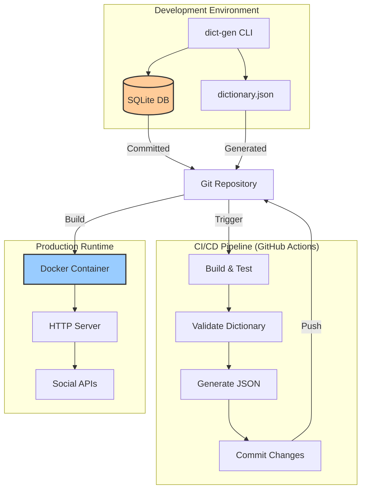

### Deployment Strategy

**Development Workflow:**
1. Content manager edits SQLite database locally or via DB tool
2. Run `dict-gen validate` to check integrity
3. Run `dict-gen generate` to create dictionary.json
4. Commit both SQLite DB and generated JSON to Git
5. Push to repository

**CI/CD Workflow:**
1. GitHub Actions triggered on push
2. Build Go binary and CLI tool
3. Run validation tests
4. Optionally regenerate dictionary.json in CI
5. Run application tests
6. Build Docker image
7. Deploy to production (Google Cloud Run or similar)

**Production Deployment:**
- Docker container includes pre-generated dictionary.json
- SQLite database NOT needed at runtime (stateless server)
- HTTP server remains unchanged
- Scaling: Horizontal scaling of HTTP servers (stateless)

### File Locations

```
/home/runner/work/te-reo-bot/te-reo-bot/
├── cmd/
│   ├── server/           # Existing HTTP server
│   │   ├── main.go
│   │   └── dictionary.json      # Generated artifact
│   └── dict-gen/         # NEW: CLI tool
│       └── main.go
├── data/                 # NEW: Database directory
│   └── words.db          # SQLite database file
├── pkg/
│   ├── repository/       # NEW: Data access layer
│   ├── validator/        # NEW: Validation logic
│   ├── generator/        # NEW: JSON generation
│   ├── migration/        # NEW: Migration utilities
│   └── wotd/            # Existing (unchanged)
```

---

## Data Flow Diagrams

### Data Flow 1: Adding a New Word

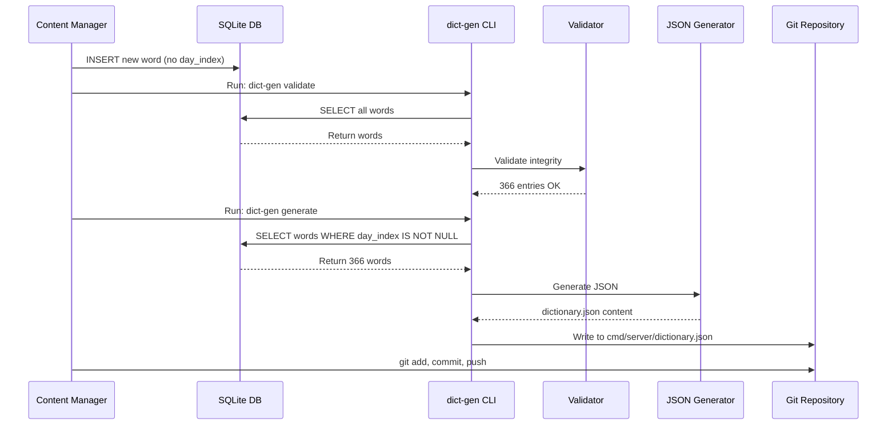

**Explanation:**

This sequence shows the workflow when a content manager adds a new word to the database. The word can be added without a day_index initially (for the word bank). When ready, the manager assigns a day_index (1-366) to make it active. The validation step ensures all 366 days are covered with unique, non-duplicate indexes. The generation step creates the dictionary.json file that the HTTP server uses.

### Data Flow 2: Daily Word Posting (Existing, Unchanged)

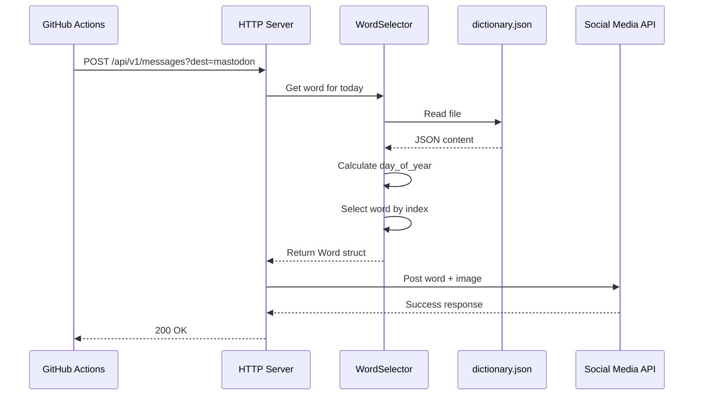

**Explanation:**

This is the existing flow that remains unchanged. The HTTP server reads dictionary.json, calculates the current day of year (1-366), and selects the corresponding word. This decoupling means the HTTP server doesn't need SQLite access at runtime, keeping it stateless and simple.

### Data Flow 3: Initial Migration (One-Time)

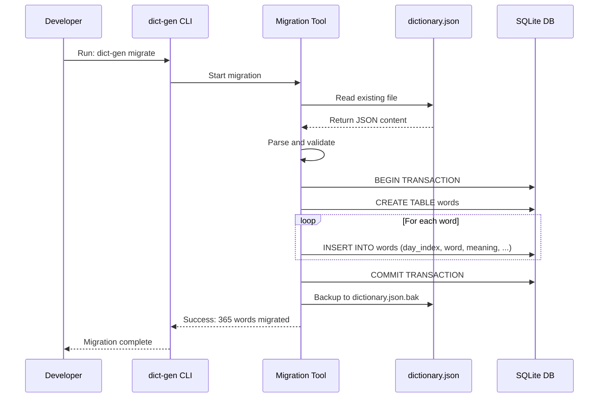

**Explanation:**

The migration process is a one-time operation to import existing dictionary.json data into the new SQLite database. It creates a backup first, then inserts all records in a transaction for atomicity. After migration, the database becomes the source of truth, and dictionary.json becomes a generated file.

---

## Key Workflows

### Sequence Diagram: Generate Dictionary Command

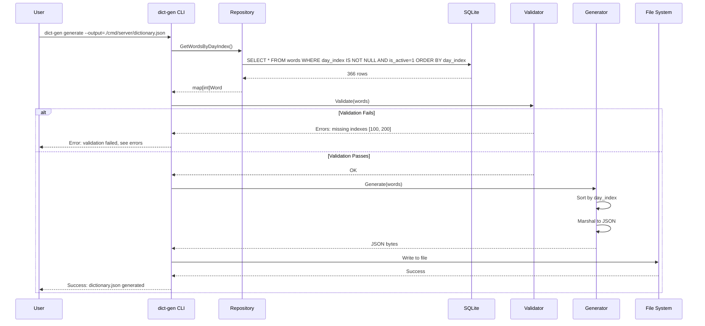

**Explanation:**

This is the core workflow of the new system. The CLI command retrieves all active words with day indexes from SQLite, validates that exactly 366 entries exist with unique indexes (1-366), generates the JSON file in the expected format, and writes it to the expected location. The validation step prevents generating an invalid dictionary.json that would break the posting functionality.

---

## Phased Development Approach

Given the complexity, we'll implement in two phases:

### Phase 1: Initial Implementation (MVP)

**Goals:**
- Minimal viable functionality
- Preserve existing behavior
- Enable basic word management

**Scope:**
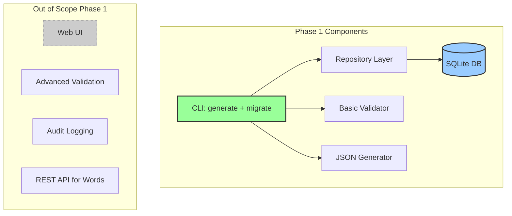

**Phase 1 Features:**
1. ✅ SQLite database schema (basic)
2. ✅ Repository layer with core CRUD operations
3. ✅ CLI command: `migrate` (import existing JSON)
4. ✅ CLI command: `generate` (create dictionary.json)
5. ✅ CLI command: `validate` (check 366 entries)
6. ✅ Basic validation rules
7. ✅ JSON generator matching current format
8. ✅ Unit tests for all components
9. ✅ Documentation for developers

**Phase 1 Exclusions:**
- ❌ Web UI for word management
- ❌ REST API for CRUD operations
- ❌ Advanced validation (e.g., UTF-8 encoding checks)
- ❌ Audit trail / history table
- ❌ CI/CD automation
- ❌ Soft delete functionality

### Phase 2: Enhanced Features

**Goals:**
- Improve user experience
- Add operational capabilities
- Enhance data integrity

**Scope:**
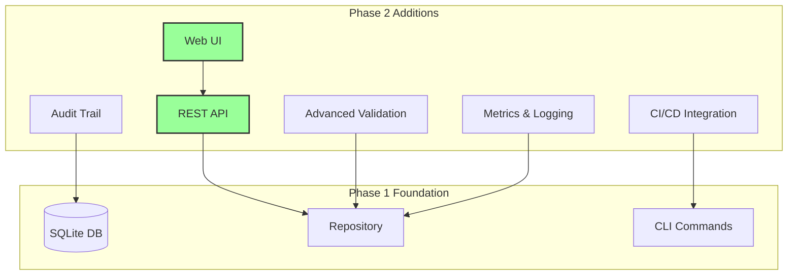

**Phase 2 Features:**
1. Web-based UI for word management (optional)
2. REST API for programmatic access
3. Enhanced validation:
   - UTF-8 encoding verification
   - Link validation (HTTP status check)
   - Image existence validation
4. Audit trail implementation
5. Soft delete with undelete functionality
6. CI/CD GitHub Actions workflow
7. Metrics and logging
8. Backup and restore utilities

### Migration Path: Phase 1 → Phase 2

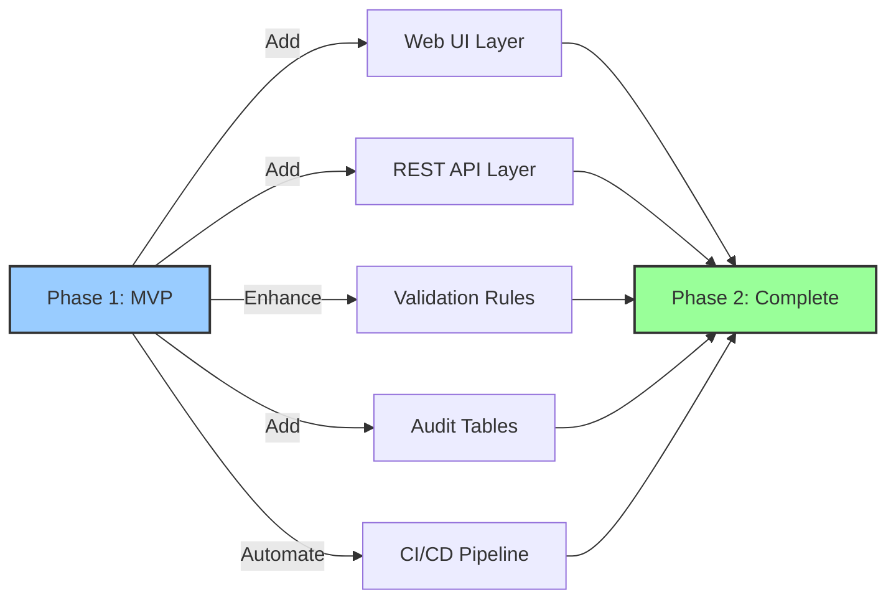

**Migration Steps:**
1. Deploy Phase 1 and stabilize
2. Gather user feedback on CLI experience
3. Assess need for Web UI vs. direct DB editing
4. Design REST API based on access patterns
5. Implement Phase 2 features incrementally
6. Roll out gradually with feature flags

---

## Non-Functional Requirements (NFR) Analysis

### 1. Scalability

**Current State:**
- Single JSON file read on each request
- No scalability concerns (small dataset)
- Stateless HTTP server

**With SQLite:**
- **Storage**: SQLite supports millions of rows; 1000s of words is trivial
- **Read Performance**: Dictionary.json remains the runtime data source (stateless)
- **Write Performance**: CLI operations are infrequent (daily/weekly)
- **Horizontal Scaling**: HTTP servers remain stateless; no impact

**Scaling Strategy:**
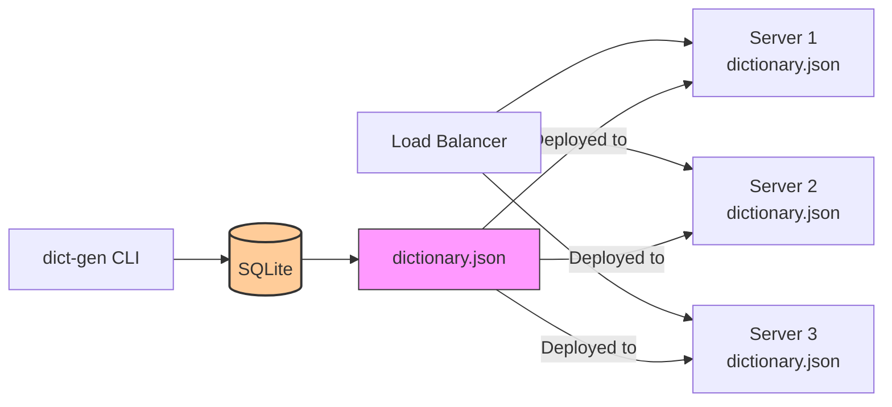

**Scalability Assessment:**
- ✅ HTTP servers: Unlimited horizontal scaling
- ✅ Database: SQLite suitable for this workload
- ✅ Generation: CLI runs infrequently, not a bottleneck
- ⚠️ Future: If word count exceeds 100K, consider PostgreSQL

### 2. Performance

**Current Performance:**
- File read: ~1ms for 365 entries
- JSON parsing: ~1ms
- Total request time: <10ms

**Expected Performance with SQLite:**
- CLI `generate` command: <100ms for 1000 words
- CLI `validate` command: <50ms
- HTTP server: **NO CHANGE** (still reads dictionary.json)

**Performance Benchmarks:**
```
Operation                | Phase 1 Target | Notes
------------------------|----------------|---------------------------
dict-gen generate       | <500ms         | Includes DB read + JSON write
dict-gen validate       | <100ms         | Pure DB query
dict-gen migrate        | <1s            | One-time operation
HTTP word selection     | <1ms           | Unchanged (in-memory lookup)
```

**Performance Optimizations:**
- Index on `day_index` column for fast lookups
- Index on `is_active` for filtering
- Keep HTTP server logic unchanged (proven performance)
- Cache database connection in CLI (persistent mode)

**Performance Monitoring:**
- Add timing logs to CLI commands
- Monitor HTTP server response times (existing)
- Set alerts for >100ms CLI operations

### 3. Security

**Threat Model:**

| Threat                          | Mitigation                                      | Priority |
|---------------------------------|------------------------------------------------|----------|
| SQL Injection                   | Prepared statements only                       | High     |
| Unauthorized database access    | File permissions (600), no network exposure   | High     |
| Malicious word content (XSS)    | Validation, escaping in clients               | Medium   |
| Database corruption             | Backups, transactions, integrity checks       | High     |
| Sensitive data in words         | No PII; public content only                   | Low      |

**Security Controls:**

1. **SQL Injection Prevention:**
   ```go
   // ✅ GOOD: Use prepared statements
   stmt, err := db.Prepare("SELECT * FROM words WHERE id = ?")
   row := stmt.QueryRow(id)
   
   // ❌ BAD: String concatenation
   query := "SELECT * FROM words WHERE id = " + id // NEVER DO THIS
   ```

2. **Database Access Control:**
   - SQLite file permissions: `chmod 600 words.db`
   - Location: Private directory, not in web root
   - No remote access (file-based database)

3. **Input Validation:**
   - Validate word length (max 200 chars)
   - Validate meaning length (max 2000 chars)
   - Sanitize URLs in `link` field
   - Check image file extensions (photo field)

4. **Content Security:**
   - No execution of user-provided content
   - UTF-8 validation for Māori characters
   - Escaping in social media clients (existing)

5. **Audit Trail (Phase 2):**
   - Log all database modifications
   - Track who made changes (changed_by field)
   - Enable forensics and rollback

**Security Assessment:**
- ✅ Low attack surface (no network DB access)
- ✅ Existing web security (HTTP server unchanged)
- ✅ Prepared statements prevent SQL injection
- ⚠️ Need input validation on CLI operations

### 4. Reliability

**Availability Target:** 99.9% uptime (same as current)

**Failure Scenarios:**

| Failure                      | Impact                           | Mitigation                          | Recovery Time |
|------------------------------|----------------------------------|-------------------------------------|---------------|
| SQLite corruption            | Cannot generate dictionary.json  | Daily backups, WAL mode, integrity checks | <1 hour       |
| Invalid generated JSON       | HTTP server fails to parse       | Validation before overwriting, keep old file | <5 minutes    |
| Missing dictionary.json      | HTTP server fails to start       | CI validation, deployment rollback  | <5 minutes    |
| CLI command failure          | Manual regeneration needed       | Idempotent operations, error handling | <10 minutes   |
| Incomplete migration         | Lost data during migration       | Backup before migration, dry-run mode | <1 hour       |

**Reliability Measures:**

1. **Database Resilience:**
   ```sql
   -- Enable Write-Ahead Logging for better concurrency and resilience
   PRAGMA journal_mode=WAL;
   
   -- Enable foreign key constraints
   PRAGMA foreign_keys=ON;
   
   -- Check database integrity
   PRAGMA integrity_check;
   ```

2. **Transactional Integrity:**
   - All CLI writes use transactions
   - Rollback on any error
   - Atomic operations (all or nothing)

3. **Validation Before Generation:**
   - Always validate before overwriting dictionary.json
   - Keep previous version as backup (.bak file)
   - Fail-fast on validation errors

4. **Backup Strategy:**
   ```
   Daily automated backups:
   - words.db → words.db.backup.YYYYMMDD
   - dictionary.json → dictionary.json.backup.YYYYMMDD
   - Retention: 30 days
   ```

5. **Idempotent Operations:**
   - `dict-gen generate` can be run multiple times safely
   - `dict-gen validate` has no side effects
   - Migration checks if data exists before inserting

**Monitoring:**
- Database integrity checks (daily)
- Validation success/failure logs
- Alert on generation failures
- Monitor backup completion

### 5. Maintainability

**Code Maintainability:**

1. **Clear Separation of Concerns:**
   ```
   cmd/dict-gen/       - CLI entry point
   pkg/repository/     - Data access (SQL)
   pkg/validator/      - Business rules
   pkg/generator/      - JSON generation
   pkg/migration/      - Migration logic
   ```

2. **Interface-Based Design:**
   ```go
   // Allows mocking for tests, swapping implementations
   type WordRepository interface {
       GetAllWords() ([]Word, error)
       // ... other methods
   }
   ```

3. **Comprehensive Testing:**
   - Unit tests for each package (>80% coverage)
   - Integration tests for database operations
   - End-to-end tests for CLI commands
   - Test fixtures with sample data

4. **Documentation:**
   - Architecture document (this file)
   - Code comments for complex logic
   - README with usage examples
   - API documentation (GoDoc)

**Operational Maintainability:**

1. **Simple Deployment:**
   - SQLite requires no separate database server
   - Single binary deployment (Go)
   - No runtime dependencies

2. **Clear Error Messages:**
   ```
   ❌ Error: Validation failed
      - Missing day indexes: 100, 150, 200
      - Duplicate day index: 42 appears 2 times
      - Total words with day_index: 363 (expected 366)
   
   💡 Fix: Ensure all days 1-366 have exactly one word assigned
   ```

3. **Logging and Debugging:**
   - Structured logging (JSON format)
   - Log levels: DEBUG, INFO, WARN, ERROR
   - Include context (operation, timestamp, user)

4. **Configuration Management:**
   ```
   # config.yaml
   database:
     path: "./data/words.db"
     backup_path: "./data/backups/"
   
   output:
     dictionary_path: "./cmd/server/dictionary.json"
     format: "pretty"  # or "compact"
   
   validation:
     required_indexes: 366
     strict_mode: true
   ```

5. **Migration Path:**
   - Backward compatible schema changes
   - Database version tracking
   - Automated migration scripts

**Developer Experience:**

```bash
# Easy local development
git clone https://github.com/wizact/te-reo-bot.git
cd te-reo-bot
go mod download

# One-time migration
go run cmd/dict-gen/main.go migrate --input=./cmd/server/dictionary.json

# Daily workflow
go run cmd/dict-gen/main.go validate
go run cmd/dict-gen/main.go generate

# Testing
go test ./...
```

**Maintainability Assessment:**
- ✅ Clean architecture with clear boundaries
- ✅ Testable design with interfaces
- ✅ Simple deployment (no external dependencies)
- ✅ Clear error messages and logging
- ⚠️ Need documentation for content managers

---

## Risks and Mitigations

| Risk                                      | Probability | Impact | Mitigation                                                                 | Owner          |
|-------------------------------------------|-------------|--------|---------------------------------------------------------------------------|----------------|
| Data loss during migration                | Low         | High   | Backup before migration; dry-run mode; validation checks                  | Developer      |
| Generated JSON doesn't match schema       | Medium      | High   | Comprehensive unit tests; integration tests; validation before overwrite  | Developer      |
| SQLite corruption                         | Low         | High   | WAL mode; daily backups; integrity checks; transaction safety            | DevOps         |
| Content managers struggle with SQLite     | Medium      | Medium | Provide GUI tools (e.g., DB Browser); documentation; training            | Tech Lead      |
| Performance regression                    | Low         | Medium | Benchmark tests; load testing; maintain JSON-based runtime               | Developer      |
| Breaking existing HTTP server             | Low         | High   | No changes to HTTP server; integration tests; staged rollout             | Developer      |
| Invalid UTF-8 for Māori characters        | Medium      | Medium | UTF-8 validation; encoding tests; editor configuration guidance          | Developer      |
| Missing day index assignments             | Medium      | High   | Validation command; CI checks; alerting                                   | DevOps         |
| Incomplete test coverage                  | Medium      | Medium | Require >80% coverage; code review checklist; automated checks           | Tech Lead      |
| Difficulty reverting to old system        | Low         | Medium | Keep old JSON file; document rollback procedure; feature flag            | Tech Lead      |

### Critical Risk: Data Loss During Migration

**Scenario:** Migration script fails halfway, corrupting both old JSON and new database.

**Mitigation Plan:**
1. **Pre-Migration:**
   - Create backup: `cp dictionary.json dictionary.json.pre-migration`
   - Validate source data: Run existing JS validation scripts
   - Dry-run migration: Test on a copy first

2. **During Migration:**
   - Use database transactions (atomic)
   - Don't delete source file until validation passes
   - Log all operations for forensics

3. **Post-Migration:**
   - Validate database: `dict-gen validate`
   - Generate and compare: `dict-gen generate && diff dictionary.json.old dictionary.json.new`
   - Manual spot-check: Review 10 random words

4. **Rollback Plan:**
   ```bash
   # If migration fails:
   rm words.db  # Delete corrupted database
   cp dictionary.json.pre-migration dictionary.json  # Restore original
   # Fix issue and retry
   ```

### Moderate Risk: Content Manager Adoption

**Scenario:** Content managers find SQLite harder to use than JSON editing.

**Mitigation Plan:**
1. **Phase 1 (Immediate):**
   - Provide simple CLI commands:
     ```bash
     dict-gen add-word --word="Kia ora" --meaning="Hello" --day=1
     dict-gen list-words --format=table
     ```
   - Documentation with examples
   - Video tutorial

2. **Phase 2 (Future):**
   - Web UI for word management
   - REST API for programmatic access
   - Export/import features

3. **Alternative:**
   - Allow editing in SQLite Browser (GUI tool)
   - Provide pre-configured database file

---

## Technology Stack Recommendations

### Core Technologies

| Component          | Technology              | Justification                                                                 |
|--------------------|-------------------------|-------------------------------------------------------------------------------|
| Database           | SQLite 3.x              | Zero-config; file-based; sufficient for 1000s of words; ACID transactions   |
| Language           | Go 1.13+                | Existing codebase language; excellent SQLite support; single binary          |
| SQLite Driver      | `github.com/mattn/go-sqlite3` | Pure Go; CGO-based; most popular; well-maintained                  |
| CLI Framework      | Standard library `flag` | Simple needs; no heavy framework required; keep it lightweight               |
| JSON Library       | Standard library `encoding/json` | Built-in; sufficient for this use case                             |
| Testing            | `testing` + `testify`   | Existing patterns; assertions library for readability                        |

### Alternative Technologies Considered

| Technology                  | Pros                                  | Cons                                | Decision        |
|-----------------------------|---------------------------------------|-------------------------------------|-----------------|
| PostgreSQL                  | More powerful; better for large scale | Requires server; overkill for this  | ❌ Rejected     |
| MySQL                       | Widely known; robust                  | Requires server; unnecessary        | ❌ Rejected     |
| JSON file (keep current)    | Simple; no new dependencies           | Cannot store >366 words; hard to edit | ❌ Insufficient |
| CSV file                    | Easy to edit in Excel                 | No validation; no transactions      | ❌ Rejected     |
| Cobra CLI framework         | Rich features; popular                | Overkill for simple commands        | ❌ Unnecessary  |
| GORM (ORM)                  | Higher-level abstraction              | Adds complexity; unnecessary        | ❌ Rejected     |

### Dependency Management

**New Dependencies:**
```go
// go.mod additions
require (
    github.com/mattn/go-sqlite3 v1.14.18  // SQLite driver
)
```

**No additional dependencies needed** - Keep it minimal!

### Development Tools

| Tool                        | Purpose                          | Installation                          |
|-----------------------------|----------------------------------|---------------------------------------|
| Go 1.13+                    | Compile and run                  | Already installed                     |
| SQLite3 CLI                 | Database inspection              | `apt install sqlite3` (optional)      |
| DB Browser for SQLite       | GUI database tool                | Download from sqlitebrowser.org       |
| gopls                       | Go language server               | `go install golang.org/x/tools/gopls` |
| golangci-lint               | Code linting                     | Already in project                    |

---

## Next Steps: Step-by-Step Implementation Tasks

### Task 1: Database Schema Setup
**Priority:** High | **Effort:** Small (2-4 hours)

1. Create `pkg/repository/schema.go`:
   - Define SQL schema as Go constant
   - Include CREATE TABLE statements
   - Add indexes
   - Add comments for documentation

2. Create `pkg/repository/db.go`:
   - Initialize database function
   - Apply schema
   - Handle migrations (future-proof)
   - Add integrity check

3. Write tests:
   - Test schema creation
   - Test constraints (unique day_index)
   - Test indexes exist

**Acceptance Criteria:**
- ✅ Schema creates successfully in SQLite
- ✅ Constraints work (duplicate day_index fails)
- ✅ Tests pass
- ✅ Database file created at `./data/words.db`

---

### Task 2: Repository Layer Implementation
**Priority:** High | **Effort:** Medium (6-8 hours)

1. Define interfaces in `pkg/repository/interface.go`:
   ```go
   type WordRepository interface {
       GetAllWords() ([]Word, error)
       GetWordsByDayIndex() (map[int]Word, error)
       GetWordByID(id int) (*Word, error)
       AddWord(word *Word) error
       UpdateWord(word *Word) error
       DeleteWord(id int) error
       GetWordCount() (int, error)
   }
   ```

2. Implement in `pkg/repository/sqlite_repository.go`:
   - Open database connection
   - Prepared statements for all queries
   - Transaction support
   - Error handling

3. Create `pkg/repository/models.go`:
   - Define Word struct matching DB schema
   - Add JSON tags for compatibility
   - Add validation tags

4. Write comprehensive tests:
   - CRUD operations
   - Transaction rollback
   - Error cases
   - Concurrent access (if needed)

**Acceptance Criteria:**
- ✅ All interface methods implemented
- ✅ Uses prepared statements (no SQL injection risk)
- ✅ Test coverage >80%
- ✅ Works with in-memory DB (`:memory:`) for tests

---

### Task 3: Migration Tool
**Priority:** High | **Effort:** Medium (4-6 hours)

1. Create `pkg/migration/migrate.go`:
   - Parse existing dictionary.json
   - Map JSON structure to Word struct
   - Batch insert with transaction
   - Progress reporting

2. Handle edge cases:
   - Duplicate indexes in source
   - Invalid JSON structure
   - Missing required fields

3. Add rollback capability:
   - Backup original file
   - Checkpoint before commit

4. Create CLI command in `cmd/dict-gen/migrate.go`:
   - Accept input file path flag
   - Accept database path flag
   - Show progress bar
   - Confirm before proceeding

**Acceptance Criteria:**
- ✅ Migrates all 365+ words from existing dictionary.json
- ✅ Creates backup before starting
- ✅ Validates data before commit
- ✅ Reports success/failure clearly
- ✅ Can run multiple times safely (idempotent)

---

### Task 4: Validation Engine
**Priority:** High | **Effort:** Medium (4-6 hours)

1. Create `pkg/validator/validator.go`:
   - Implement validation rules
   - Return structured errors/warnings
   - Support different validation levels (strict/relaxed)

2. Validation rules:
   - Exactly 366 words with day_index (1-366)
   - No duplicate day_index values
   - No gaps in sequence
   - Required fields non-empty (word, meaning)
   - Optional: UTF-8 validation
   - Optional: URL validation for links

3. Create `pkg/validator/report.go`:
   - Validation report structure
   - Summary statistics
   - Detailed error messages
   - Suggestions for fixes

4. Write tests:
   - Valid dataset (passes)
   - Missing indexes (fails)
   - Duplicate indexes (fails)
   - Empty required fields (fails)

**Acceptance Criteria:**
- ✅ Detects all validation errors
- ✅ Provides helpful error messages
- ✅ Returns structured report
- ✅ Test coverage >90%

---

### Task 5: JSON Generator
**Priority:** High | **Effort:** Small (3-4 hours)

1. Create `pkg/generator/generator.go`:
   - Accept sorted words
   - Marshal to JSON format
   - Match existing schema exactly
   - Handle UTF-8 encoding properly

2. Output formatting:
   - Pretty-print option (human-readable)
   - Compact option (production)
   - Consistent field ordering

3. File handling:
   - Atomic write (write to temp, then rename)
   - Preserve original if generation fails
   - Set proper file permissions

4. Write tests:
   - Generated JSON matches expected format
   - Roundtrip: parse generated JSON successfully
   - UTF-8 characters preserved
   - Compare with original dictionary.json structure

**Acceptance Criteria:**
- ✅ Generates valid JSON
- ✅ Matches existing dictionary.json structure exactly
- ✅ Preserves Māori characters (UTF-8)
- ✅ Atomic write (no partial files)

---

### Task 6: CLI Command Implementation
**Priority:** High | **Effort:** Medium (6-8 hours)

1. Create `cmd/dict-gen/main.go`:
   - Main entry point
   - Subcommand routing
   - Global flags (database path, verbosity)

2. Implement subcommands:
   - `migrate`: Import dictionary.json to SQLite
   - `generate`: Generate dictionary.json from SQLite
   - `validate`: Check database integrity
   - `add-word`: Add a single word (utility)
   - `list-words`: List all words (utility)

3. Create `cmd/dict-gen/flags.go`:
   - Define all flags
   - Validation
   - Help text

4. User experience:
   - Colorized output (success/error)
   - Progress indicators
   - Confirmation prompts for destructive operations
   - Verbose mode for debugging

5. Write tests:
   - Integration tests for each command
   - Flag parsing
   - Error handling
   - Help text

**Acceptance Criteria:**
- ✅ All commands work end-to-end
- ✅ Clear error messages
- ✅ Help text for all commands
- ✅ Exit codes (0=success, non-zero=error)

---

### Task 7: Documentation
**Priority:** High | **Effort:** Small (2-3 hours)

1. Create `docs/SQLite_Setup.md`:
   - Installation instructions
   - Migration guide (step-by-step)
   - Troubleshooting

2. Update `README.md`:
   - Document new CLI commands
   - Usage examples
   - Architecture overview link

3. Create `docs/Content_Manager_Guide.md`:
   - How to add/edit words
   - SQLite Browser setup
   - Common workflows

4. Add inline code comments:
   - Document complex logic
   - Explain design decisions
   - Add TODOs for Phase 2

**Acceptance Criteria:**
- ✅ Clear setup instructions
- ✅ Examples for all CLI commands
- ✅ Troubleshooting section
- ✅ Screenshots/diagrams where helpful

---

### Task 8: Testing & Validation
**Priority:** High | **Effort:** Medium (4-6 hours)

1. Unit tests:
   - Each package has >80% coverage
   - Mock database for repository tests
   - Edge cases covered

2. Integration tests:
   - End-to-end CLI workflows
   - Actual SQLite database
   - Validate generated dictionary.json

3. Regression tests:
   - Existing HTTP server still works
   - WordSelector logic unchanged
   - Social media posting unchanged

4. Manual testing checklist:
   - Run migration with actual dictionary.json
   - Validate migrated data
   - Generate new dictionary.json
   - Compare old vs. new dictionary.json
   - Start HTTP server with new file
   - Test a POST request
   - Verify word selection logic

**Acceptance Criteria:**
- ✅ All tests pass
- ✅ Coverage >80%
- ✅ Manual testing checklist completed
- ✅ No regressions in existing functionality

---

### Task 9: CI/CD Integration (Optional Phase 1)
**Priority:** Medium | **Effort:** Small (2-3 hours)

1. Update `.github/workflows/go.yml`:
   - Add SQLite installation
   - Run database tests
   - Validate schema

2. Add workflow: `validate-dictionary.yml`:
   - Run `dict-gen validate` on push
   - Fail if validation fails
   - Comment on PR with validation results

3. Add pre-commit hook:
   - Run validation locally before commit
   - Prevent committing invalid database

**Acceptance Criteria:**
- ✅ CI tests include SQLite
- ✅ Validation runs on every push
- ✅ Pre-commit hook available (opt-in)

---

### Task 10: Deployment & Rollout
**Priority:** High | **Effort:** Small (2-3 hours)

1. Create deployment checklist:
   - Backup current dictionary.json
   - Run migration
   - Validate migrated data
   - Generate new dictionary.json
   - Test HTTP server
   - Commit both DB and JSON to Git

2. Rollback procedure:
   - Restore original dictionary.json
   - Delete SQLite database
   - Document steps

3. Monitoring:
   - Add logging for CLI operations
   - Set up alerts for generation failures

4. Communication:
   - Announce changes to team
   - Schedule training for content managers
   - Create FAQ document

**Acceptance Criteria:**
- ✅ Deployment checklist completed
- ✅ Rollback procedure tested
- ✅ Team informed and trained
- ✅ Monitoring in place

---

## Implementation Order Summary

**Phase 1 Sprint Plan:**

| Week | Tasks | Deliverables |
|------|-------|--------------|
| 1    | Task 1 (Schema), Task 2 (Repository) | Working repository layer with tests |
| 2    | Task 3 (Migration), Task 4 (Validation) | Migration tool and validation engine |
| 3    | Task 5 (Generator), Task 6 (CLI) | Complete CLI tool |
| 4    | Task 7 (Docs), Task 8 (Testing) | Documentation and comprehensive tests |
| 5    | Task 9 (CI/CD), Task 10 (Deployment) | Production deployment |

**Total Effort Estimate:** 40-50 hours (1-2 developer weeks)

---

## Testing Strategy

### Unit Testing

**Coverage Target:** >80% for all new packages

**Test Structure:**
```go
// pkg/repository/sqlite_repository_test.go
func TestSQLiteRepository_GetAllWords(t *testing.T) {
    // Setup: in-memory database
    db := setupTestDB(t)
    defer db.Close()
    repo := NewSQLiteRepository(db)
    
    // Given: sample words
    seedTestData(t, repo)
    
    // When: retrieve all words
    words, err := repo.GetAllWords()
    
    // Then: verify results
    assert.NoError(t, err)
    assert.Len(t, words, 5)
}
```

**Mock Database:**
```go
// Use in-memory SQLite for fast, isolated tests
func setupTestDB(t *testing.T) *sql.DB {
    db, err := sql.Open("sqlite3", ":memory:")
    require.NoError(t, err)
    
    // Apply schema
    _, err = db.Exec(schema)
    require.NoError(t, err)
    
    return db
}
```

### Integration Testing

**Test Scenarios:**
1. **End-to-End Migration:**
   - Input: dictionary.json
   - Run: `dict-gen migrate`
   - Verify: All words in database
   - Verify: Indexes preserved

2. **End-to-End Generation:**
   - Input: Populated database
   - Run: `dict-gen generate`
   - Verify: Valid dictionary.json created
   - Verify: Matches original structure

3. **Validation Scenarios:**
   - Test with missing indexes (should fail)
   - Test with duplicate indexes (should fail)
   - Test with valid data (should pass)

### Regression Testing

**Critical Paths:**
1. HTTP server still starts successfully
2. WordSelector.SelectWordByDay() works with new JSON
3. Social media posting still functions
4. JSON structure exactly matches original

**Regression Test Suite:**
```bash
# Before changes
go test ./... > baseline.txt

# After changes
go test ./... > updated.txt

# Compare
diff baseline.txt updated.txt
# Should show NO differences in existing tests
```

### Manual Testing Checklist

- [ ] Install SQLite3
- [ ] Run migration on actual dictionary.json
- [ ] Inspect database with `sqlite3` CLI
- [ ] Run validation command
- [ ] Generate new dictionary.json
- [ ] Compare with original using `diff`
- [ ] Start HTTP server
- [ ] POST to /api/v1/messages?dest=mastodon&wordIndex=1
- [ ] Verify word posted correctly
- [ ] Check server logs for errors

---

## Conclusion

This architecture provides a solid foundation for managing the Te Reo Bot's dictionary using SQLite while preserving the simplicity and reliability of the existing system. The phased approach allows for incremental delivery, with Phase 1 focusing on essential functionality and Phase 2 adding enhancements based on real-world usage.

**Key Success Factors:**
1. ✅ Maintain backward compatibility (HTTP server unchanged)
2. ✅ Keep it simple (no over-engineering)
3. ✅ Comprehensive testing (prevent regressions)
4. ✅ Clear documentation (enable adoption)
5. ✅ Strong validation (data integrity)
6. ✅ Safe migration (no data loss)

**Next Action:**
- Review this architecture document with stakeholders
- Get approval to proceed
- Begin implementation with Task 1 (Database Schema)

---

## Appendix: Example CLI Commands

### Migration
```bash
# Migrate existing dictionary.json to SQLite
$ dict-gen migrate --input=./cmd/server/dictionary.json --db=./data/words.db

🔄 Starting migration...
📖 Reading dictionary.json... ✓
📝 Found 365 words
🗄️  Creating database... ✓
📥 Inserting words...
    [####################] 365/365 words (100%)
✅ Migration complete!
   - 365 words migrated
   - Backup created: dictionary.json.backup.20250119
   - Database: ./data/words.db

💡 Next steps:
   1. Run: dict-gen validate
   2. Run: dict-gen generate
   3. Commit: git add data/words.db cmd/server/dictionary.json
```

### Validation
```bash
# Validate database integrity
$ dict-gen validate --db=./data/words.db

🔍 Validating database...
✓ Database schema valid
✓ Total words: 365
✓ Words with day_index: 365
✓ Day index range: 1-365
✗ Missing day index: 366

❌ Validation failed!
   Missing day indexes: [366]
   
💡 Fix: Add a word for day 366 (leap year)
```

### Generation
```bash
# Generate dictionary.json from database
$ dict-gen generate --db=./data/words.db --output=./cmd/server/dictionary.json

🔄 Generating dictionary.json...
📊 Fetching words from database... ✓
🔍 Validating data... ✓
📝 Generating JSON... ✓
💾 Writing to file... ✓

✅ Dictionary generated successfully!
   - Output: ./cmd/server/dictionary.json
   - Words: 366
   - Size: 145 KB
   - Format: pretty (indented)
   
💡 Next steps:
   1. Review changes: git diff cmd/server/dictionary.json
   2. Test server: go run cmd/server/main.go
   3. Commit: git add cmd/server/dictionary.json
```

### Add Word
```bash
# Add a new word (no day index yet)
$ dict-gen add-word \
    --word="Kia ora" \
    --meaning="Hello, be well" \
    --db=./data/words.db

✅ Word added successfully!
   - ID: 367
   - Word: Kia ora
   - Meaning: Hello, be well
   - Day index: (not assigned)
   
💡 To assign to a day, use:
   dict-gen update-word --id=367 --day-index=1
```

### List Words
```bash
# List all words with their day indexes
$ dict-gen list-words --db=./data/words.db --format=table

 ID  | Day | Word              | Meaning
-----|-----|-------------------|---------------------------------
 1   | 1   | ngā mihi o te...  | happy new year, greetings...
 2   | 2   | Korimako          | The New Zealand bellbird...
 3   | 3   | Karure, Kakaruia  | Chatham Island black robin...
 ... | ... | ...               | ...
 365 | 365 | hararei           | to have a holiday...
 366 | 366 | H'ngongoi         | July (month of)
 367 | -   | Kia ora           | Hello, be well

Total: 367 words (366 with day_index, 1 unassigned)
```

---

**Document Version:** 1.0  
**Last Updated:** 2025-01-19  
**Author:** Senior Cloud Architect (GitHub Copilot)  
**Status:** Draft - Awaiting Review
